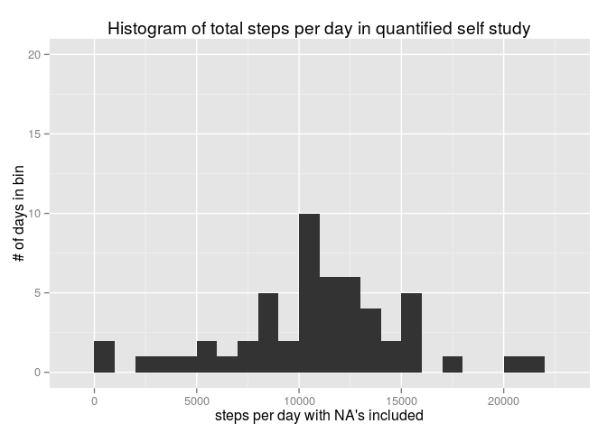
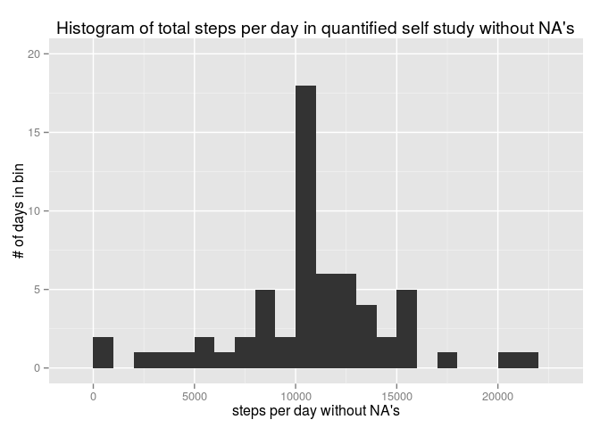
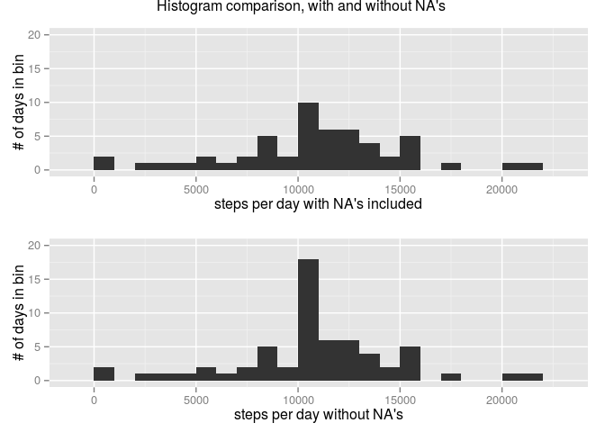
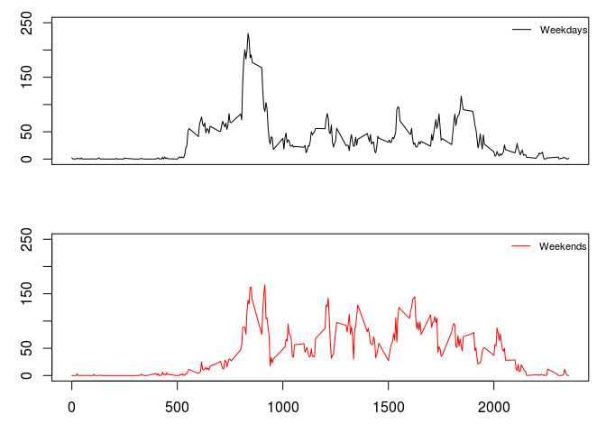

# Reproducible Research: Peer Assessment 1
Adam Chandler  


## Set working directory and load libraries


```r
date()
```

```
## [1] "Sun Jan 18 12:20:35 2015"
```

```r
library(dplyr)
```

```
## 
## Attaching package: 'dplyr'
## 
## The following object is masked from 'package:stats':
## 
##     filter
## 
## The following objects are masked from 'package:base':
## 
##     intersect, setdiff, setequal, union
```

```r
library(ggplot2)
library(gridExtra)
```

```
## Loading required package: grid
```

```r
getwd()
```

```
## [1] "/home/adamad/RStudio/projects/coursera/reproducible research/project1/RepData_PeerAssessment1"
```

```r
# adjust path to your computer, of course
setwd("~/RStudio/projects/coursera/reproducible research/project1/RepData_PeerAssessment1")
```


## 1. Loading and preprocessing the data 

* Show any code that is needed to  
* Load the data (i.e. read.csv())  
* Process/transform the data (if necessary) into a format suitable for your analysis  


```r
unzip("activity.zip")
activity <- read.csv("activity.csv", stringsAsFactors=FALSE)
activity$date <- as.factor(activity$date)
```


## 2. What is mean total number of steps taken per day?  

* For this part of the assignment, you can ignore the missing values in the dataset.  
* Make a histogram of the total number of steps taken each day  


```r
activity <- tbl_df(activity)
steps_perday <- activity %>% group_by(date) %>% summarise(steps_perday = sum(steps))
head(steps_perday)
```

```
## Source: local data frame [6 x 2]
## 
##         date steps_perday
## 1 2012-10-01           NA
## 2 2012-10-02          126
## 3 2012-10-03        11352
## 4 2012-10-04        12116
## 5 2012-10-05        13294
## 6 2012-10-06        15420
```

```r
ggplot(steps_perday, aes(x=steps_perday)) + geom_histogram(binwidth = 1000) + ylab("# of days in bin") + xlab("steps per day with NA's included") + ggtitle("Histogram of total steps per day in quantified self study")  + ylim(0,20)
```

 

```r
p2 <- ggplot(steps_perday, aes(x=steps_perday)) + geom_histogram(binwidth = 1000) + ylab("# of days in bin") + xlab("steps per day with NA's included") + ylim(0,20)
```

* Calculate and report the mean and median total number of steps taken per day  


```r
summary(steps_perday$steps_perday)
```

```
##    Min. 1st Qu.  Median    Mean 3rd Qu.    Max.    NA's 
##      41    8841   10760   10770   13290   21190       8
```


## 3. What is the average daily activity pattern?  

* Make a time series plot (i.e. type = "l") of the 5-minute interval (x-axis) and the average number of steps taken, averaged across all days (y-axis)


```r
meansteps_byinterval <- activity  %>% group_by(interval) %>% filter(!is.na(steps)) %>% summarise(meansteps_peri =round(mean(steps),1) )
head(meansteps_byinterval)
```

```
## Source: local data frame [6 x 2]
## 
##   interval meansteps_peri
## 1        0            1.7
## 2        5            0.3
## 3       10            0.1
## 4       15            0.2
## 5       20            0.1
## 6       25            2.1
```

```r
summary(meansteps_byinterval$meansteps_peri)
```

```
##    Min. 1st Qu.  Median    Mean 3rd Qu.    Max. 
##    0.00    2.50   34.10   37.38   52.88  206.20
```

```r
plot(meansteps_byinterval$interval, meansteps_byinterval$meansteps_peri, xlab="interval", ylab="mean steps per interval", type="l", col="black")
```

 

* Which 5-minute interval, on average across all the days in the dataset, contains the maximum number of steps?


```r
meansteps_byinterval %>% arrange(desc(meansteps_peri)) %>% head(1)
```

```
## Source: local data frame [1 x 2]
## 
##   interval meansteps_peri
## 1      835          206.2
```


## 4. Inputting missing values  

* Note that there are a number of days/intervals where there are missing values (coded as NA). The presence of missing days may introduce bias into some calculations or summaries of the data.
 
* Calculate and report the total number of missing values in the dataset (i.e. the total number of rows with NAs)


```r
head(activity[is.na(activity$steps),])
```

```
## Source: local data frame [6 x 3]
## 
##   steps       date interval
## 1    NA 2012-10-01        0
## 2    NA 2012-10-01        5
## 3    NA 2012-10-01       10
## 4    NA 2012-10-01       15
## 5    NA 2012-10-01       20
## 6    NA 2012-10-01       25
```

```r
summary(activity$steps)
```

```
##    Min. 1st Qu.  Median    Mean 3rd Qu.    Max.    NA's 
##    0.00    0.00    0.00   37.38   12.00  806.00    2304
```

* Devise a strategy for filling in all of the missing values in the dataset. The strategy does not need to be sophisticated. For example, you could use the mean/median for that day, or the mean for that 5-minute interval, etc.
 
* Create a new dataset that is equal to the original dataset but with the missing data filled in.


```r
activity_withno_na <- activity
head(activity_withno_na[is.na(activity_withno_na$steps),])
```

```
## Source: local data frame [6 x 3]
## 
##   steps       date interval
## 1    NA 2012-10-01        0
## 2    NA 2012-10-01        5
## 3    NA 2012-10-01       10
## 4    NA 2012-10-01       15
## 5    NA 2012-10-01       20
## 6    NA 2012-10-01       25
```

```r
head(meansteps_byinterval)
```

```
## Source: local data frame [6 x 2]
## 
##   interval meansteps_peri
## 1        0            1.7
## 2        5            0.3
## 3       10            0.1
## 4       15            0.2
## 5       20            0.1
## 6       25            2.1
```

```r
for (i in seq(0,2355, by = 5) ) {
  this_interval <- i
  m <- activity_withno_na$interval == this_interval & is.na(activity_withno_na$steps)
  activity_withno_na$steps[m] <- meansteps_byinterval$meansteps_peri[meansteps_byinterval$interval == this_interval]
}

summary(activity$steps)
```

```
##    Min. 1st Qu.  Median    Mean 3rd Qu.    Max.    NA's 
##    0.00    0.00    0.00   37.38   12.00  806.00    2304
```

```r
summary(activity_withno_na$steps)
```

```
##    Min. 1st Qu.  Median    Mean 3rd Qu.    Max. 
##    0.00    0.00    0.00   37.38   27.00  806.00
```


* Make a histogram of the total number of steps taken each day and Calculate and report the mean and median total number of steps taken per day. Do these values differ from the estimates from the first part of the assignment? What is the impact of imputing missing data on the estimates of the total daily number of steps?


```r
activity_withno_na <- tbl_df(activity_withno_na)
steps_perday_withno_na <- activity_withno_na %>% group_by(date) %>% summarise(steps_perday = sum(steps))
head(steps_perday_withno_na)
```

```
## Source: local data frame [6 x 2]
## 
##         date steps_perday
## 1 2012-10-01      10766.2
## 2 2012-10-02        126.0
## 3 2012-10-03      11352.0
## 4 2012-10-04      12116.0
## 5 2012-10-05      13294.0
## 6 2012-10-06      15420.0
```

```r
ggplot(steps_perday_withno_na, aes(x=steps_perday)) + geom_histogram(binwidth = 1000) + ylab("# of days in bin") + xlab("steps per day without NA's") + ggtitle("Histogram of total steps per day in quantified self study without NA's") + ylim(0,20)
```

 

```r
p4 <- ggplot(steps_perday_withno_na, aes(x=steps_perday)) + geom_histogram(binwidth = 1000) + ylab("# of days in bin") + xlab("steps per day without NA's")  + ylim(0,20)

summary(steps_perday$steps_perday)
```

```
##    Min. 1st Qu.  Median    Mean 3rd Qu.    Max.    NA's 
##      41    8841   10760   10770   13290   21190       8
```

```r
summary(steps_perday_withno_na$steps_perday)
```

```
##    Min. 1st Qu.  Median    Mean 3rd Qu.    Max. 
##      41    9819   10770   10770   12810   21190
```

```r
grid.arrange(p2, p4, ncol=1, main = "Histogram comparison, with and without NA's ")
```

 


## 5. Are there differences in activity patterns between weekdays and weekends?  

* For this part the weekdays() function may be of some help here. Use the dataset with the filled-in missing values for this part.
 
* Create a new factor variable in the dataset with two levels – “weekday” and “weekend” indicating whether a given date is a weekday or weekend day.
 

```r
activity_withno_na_pluswkd <- activity_withno_na
activity_withno_na_pluswkd$date <- as.POSIXct(activity_withno_na_pluswkd$date)
activity_withno_na_pluswkd <- activity_withno_na_pluswkd %>% mutate(dow = weekdays(date), tod = "weekday")
tfsat <- activity_withno_na_pluswkd$dow == "Saturday"
activity_withno_na_pluswkd$tod[tfsat] <- "weekend"
tfsun <- activity_withno_na_pluswkd$dow == "Sunday"
activity_withno_na_pluswkd$tod[tfsun] <- "weekend"
activity_withno_na_pluswkd$tod <- as.factor(activity_withno_na_pluswkd$tod)
activity_withno_na_pluswkd$dow <- NULL
```
 
 
* Make a panel plot containing a time series plot (i.e. type = "l") of the 5-minute interval (x-axis) and the average number of steps taken, averaged across all weekday days or weekend days (y-axis). See the README file in the GitHub repository to see an example of what this plot should look like using simulated data.


```r
meansteps_weekdays <- activity_withno_na_pluswkd  %>% group_by(interval) %>% filter(tod == "weekday") %>% summarise(meansteps_peri =round(mean(steps),1) )
meansteps_weekends <- activity_withno_na_pluswkd  %>% group_by(interval) %>% filter(tod == "weekend") %>% summarise(meansteps_peri =round(mean(steps),1) )

# plot together
par(mfrow = c(2,1))
par(mar=c(3,3,1,1))
plot(meansteps_weekdays$interval, meansteps_weekdays$meansteps_peri, xlab="", ylab="mean steps", ylim=c(0,250), type="l", col="black", xaxt='n')
legend("topright", legend=c("Weekdays"), col=c("black"), lwd=c(1), lty=1, cex=0.7, bty = "n")
plot(meansteps_weekends$interval, meansteps_weekends$meansteps_peri, xlab="", ylab="mean steps", ylim=c(0,250), type="l", col="red")
legend("topright", legend=c("Weekends"), col=c("red"), lwd=c(1), lty=1, cex=0.7, bty = "n")
```

 


